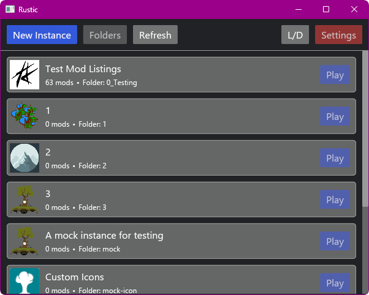
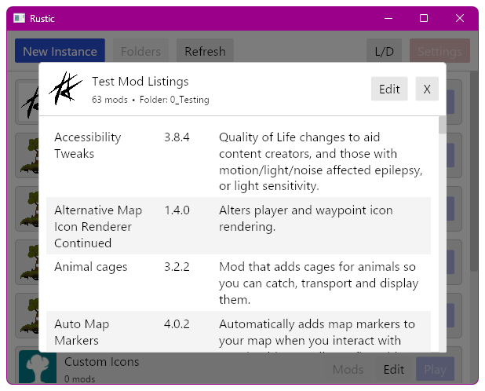

Rustic

[](LICENSE)
===========

~~Basic instance and mod manager for Vintage Story.~~   
Just a basic, barely functional mockup for now.




## !! VERY WIP !!

- [X] Mockup
- [X] Instances
  - [X] Create and edit instances
  - [X] Display mods
  - [X] Custom icons from icons folder
  - [ ] Delete instances *(maybe move to trash or flag as deleted?)*
- [ ] Start the game via `--dataPath`
- [ ] Launcher settings
- [ ] Mod DB
  - [ ] Mod updates
  - [ ] Mod dependencies

## Notes

### Usage without Rustic

- Maybe generate a Shortcut that has the same effect as launching from Rustic?
  - Recreate when settings are changed

### Config: sync with global/normal config?

- Copy global config when creating a new instance?
- Option to copy values from global config?
  - Maybe copy specific values before launch?

### Config: `stringListSettings.modPaths`

- Always needs `"Mods"` to load base content from install folder
- Folders added by `--addModPath` are always loaded, no need to add to config
  - Always set `"...\\InstanceFolder\\Mods"` with this as well ?
- Should have the instance mods folder, without this all mods placed there are ignored
  - Write the correct value before start in case the instance folder was moved
  - Can relative paths be used? Maybe placeholders to get `dataPath `?

```json
{
  "stringListSettings": {
    "modPaths": [
      "Mods",
      "...\\InstanceFolder\\Mods"
    ]
  }
}
```
