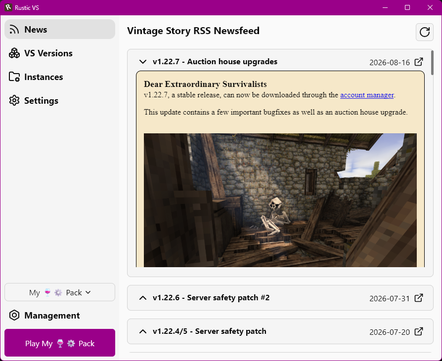
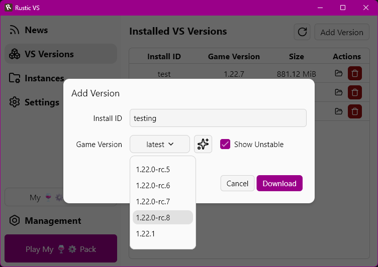
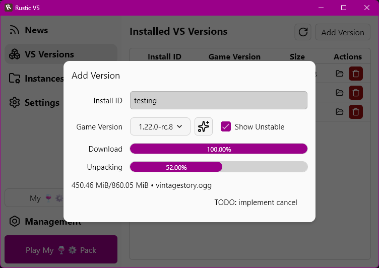

Rustic

===========

~~Basic instance and mod manager for Vintage Story.~~   
Just a basic, barely functional mockup for now.

## !! VERY WIP !!

Redoing everything with [freya](https://crates.io/crates/freya)...

## Features

- RSS Feed
- Download and manage VS versions
- _TODO: Manage multiple instances, each standalone with its mods and configs_
- _TODO: Download and update from the official ModDB_

## Screenshots

### Download new Vintage Story versions

## Thanks to

* [Freya](https://github.com/marc2332/freya) is a very cool Rust UI
* [Lucide](https://lucide.dev/icons/) is a nice icon set, included in Freya
* [inno](https://github.com/russellbanks/inno) avoids having to run installers, no registry pollution

## License

[MIT License](./LICENSE) - Copyright (c) 2026 Akzyra
